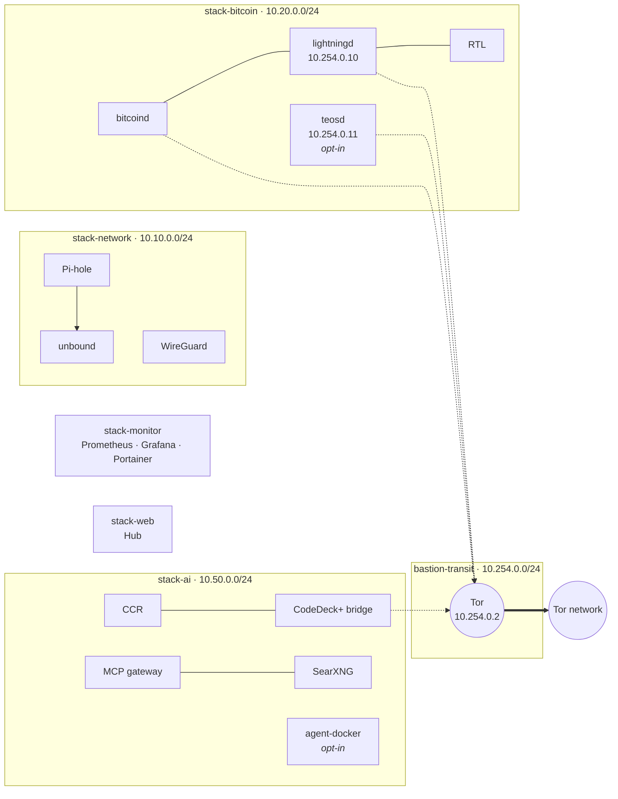

<div align="center">


# BASTION

### Sovereign Infrastructure · Operations · AI

A self-hosted node in a box: a pruned Bitcoin node and Core Lightning behind Tor,
private DNS and WireGuard, observability, one web hub, and a Claude Code AI
control plane. It is all Docker, and one script drives it.

[](https://github.com/deymosh/bastion/actions/workflows/ci.yml)
[](https://github.com/deymosh/bastion/actions/workflows/weekly.yml)

</div>

---

> [!WARNING]
> A Lightning node holds real funds. This software is provided as-is; use it at
> your own risk. Before you fund the node, read
> **[disaster recovery](docs/disaster-recovery.md)** and set up the
> **[host firewall](docs/firewall.md)**.

## Design

- **Tor-first.** All Bitcoin, Lightning, watchtower and relay traffic goes out
  through Tor. The node is reachable only through its `.onion`.
- **Segmented.** Each stack runs on its own bridge network. One narrow
  `bastion-transit` network carries the few services that must cross stacks.
- **Secrets as files.** Tokens and passwords reach containers as
  `/run/secrets/*` files, never as environment variables, so they never show up
  in `docker inspect`.
- **Pinned.** Every pulled image is pinned `tag@sha256:`, and every
  source-built component is pinned to a commit.
- **One config file.** `bastion.conf` is generated, validated and git-ignored.
  All the other files are derived from it.



## Stacks

| Stack | Runs | Subnet |
|---|---|---|
| [`stack-network`](stack-network/README.md) | Tor, Pi-hole, unbound, WireGuard. Owns `bastion-transit` and the Tor volume | `10.10.0.0/24` |
| [`stack-bitcoin`](stack-bitcoin/README.md) | `bitcoind` (pruned), Core Lightning + plugins, RTL, `teosd` *(opt-in)* | `10.20.0.0/24` |
| [`stack-monitor`](stack-monitor/README.md) | Prometheus, Grafana, node-exporter, Portainer | `10.30.0.0/24` |
| [`stack-web`](stack-web/README.md) | The Hub, a static landing page that embeds every panel | `10.40.0.0/24` |
| [`stack-ai`](stack-ai/README.md) | Claude Code Router, CodeDeck+ bridge, MCP gateway, SearXNG, `agent-docker` *(opt-in)* | `10.50.0.0/24` |

`stack-network` is the foundation. `./bastion up` always starts it first and
waits for Tor to be healthy. `stop`/`down` refuse to remove it while another
stack is still running (`--force` overrides).

## Quick start

**You need:** a Linux host (Debian/Ubuntu), Docker Engine ≥ 24 with the Compose
plugin, 16 GB RAM, 4 cores, and at least 50 GB of disk (the node is pruned to
about 20 GB of blocks).

```bash
git clone --recurse-submodules https://github.com/deymosh/bastion.git
cd bastion
./bastion up
```

The first `up`:

1. creates `bastion.conf` and fills in generated values (tokens, the Pi-hole
   password, your uid/gid and timezone);
2. asks for the three values that have no default: the WireGuard public
   host and port, and the Lightning node alias;
3. writes `secrets/` and deploys network → bitcoin → monitor → web → ai;
4. seeds RTL's config and mints its access rune from CLN.

Then:

- **Apply the firewall.** Every panel listens on `0.0.0.0` by design, so the
  host firewall is what controls access. See [docs/firewall.md](docs/firewall.md).
- **Plug in the backup drive** at `/mnt/backup_cln` (`BACKUP_DEST`). CLN
  mirrors its wallet database there live.
- **Install the boot daemon.** It brings Bastion up at boot and mirrors the
  channel backup (SCB):
  ```bash
  sudo cp services/bastion-daemon.service /etc/systemd/system/
  sudo systemctl edit --full bastion-daemon   # set WorkingDirectory= to this checkout
  sudo systemctl enable --now bastion-daemon
  journalctl -u bastion-daemon -f
  ```

## Using it

Run `./bastion` with no arguments for the interactive dashboard, which has a
stack picker, live container status, a config editor and a log viewer. Every
dashboard action is also available as a subcommand, for scripts and cron:

```bash
./bastion up    [stack...]        # deploy (default: all, in order)
./bastion stop  [stack|ctr...]    # stop a set of stacks, or one container
./bastion down  [stack...]        # stop + remove containers (data is kept)
./bastion build [stack...]        # build images without starting
./bastion logs  [stack|ctr...]    # follow logs

./bastion restart|start <ctr>     # one container
./bastion exec  <ctr> -- <cmd>    # run a command in a container
./bastion shell <ctr>             # bash if present, else sh

./bastion ps                      # every container: state, health, stack
./bastion versions                # pinned image vs. what is running
./bastion config [get|set]        # read / change bastion.conf (validated)
./bastion audit                   # routing profitability report
./bastion install-sysbox          # runtime for agent-docker (restarts Docker)
```

You can drop the `stack-` prefix (`./bastion up web ai`). Flags:

| Flag | Effect |
|---|---|
| `--with-watchtower` | also run `teosd`, your own watchtower, for this run |
| `--with-agent-docker` | also run the agent's private Docker daemon (needs Sysbox) |
| `--force`, `-f` | allow stopping `stack-network` while other stacks run |
| `--recreate-networks` | drop a stale pre-transit `bastion-network` before `up` |

To enable opt-in services permanently (including for the boot daemon), run
`./bastion config set ENABLED_PROFILES watchtower,agent-docker`.

You never need to run `docker compose` by hand: `./bastion` passes
`--env-file bastion.conf` and the right profiles on every call.

## Access

The Hub at **`http://bastion.node`** links to every panel. Pi-hole resolves
`bastion.node` to the host's LAN IP.

| Service | Port | Notes |
|---|---|---|
| Hub | `80` | Opens panels embedded, or in a new tab |
| RTL | `3000` | Lightning UI (rune minted automatically) |
| CLN REST | `3001` | For wallet apps over WireGuard |
| CCR | `3458` | Claude Code Router UI (`CCR_WEB_AUTH_TOKEN`) |
| Portainer | `4000` (https) | **Mounts the Docker socket.** Firewall it the most tightly of all |
| Grafana | `4001` | Starts with `admin` / `admin`. Change it on first login |
| Pi-hole | `8081/admin` | Password: `./bastion config get PIHOLE_PASSWORD` |
| MCP gateway | `8811/mcp` | Bearer `MCP_GATEWAY_TOKEN`. See [docs/mcp.md](docs/mcp.md) |
| Prometheus | `9090` | |
| WireGuard | `51820/udp` | **The only port meant to face the internet** |

Each panel is reachable over WireGuard, from `localhost` and from the trusted
LAN. Anything internal is never published: bitcoind RPC, Tor SOCKS/control,
CLN P2P, the TEOS API, the CCR gateway, SearXNG and the CodeDeck bridge.

## Documentation

| | |
|---|---|
| [Configuration](docs/configuration.md) | Every `bastion.conf` setting, generated from `utils/settings.registry` |
| [Disaster recovery](docs/disaster-recovery.md) | What to back up, how to restore, how to move hosts |
| [Firewall](docs/firewall.md) | nftables ruleset and a `ufw` recipe |
| [MCP gateway](docs/mcp.md) | The remote-agent tool endpoint, its namespaces and a ready-made `.mcp.json` |
| [Agent Docker](docs/agent-docker.md) | A private Docker daemon for the AI agent on Sysbox, and its security model |
| [Tests](tests/README.md) | The static / unit / integration / weekly lanes, and how to run them |
| Stack READMEs | Per-stack services, addresses and operations (linked above) |

## Pinned components

The compose files and Dockerfiles are authoritative. `./bastion versions`
compares each pin with what is running.

| Component | Version |
|---|---|
| Bitcoin Core | v26.0 |
| Core Lightning | v25.12.1, with clboss `95d195f8`, peerswap `23b32d3a`, watchtower-client `be344ecc`, trustedcoin v0.8.6, backup `cb3adab` |
| Tor | 0.4.7.13 |
| RTL | v0.15.8 |
| Pi-hole · unbound · WireGuard | 2026.07.2 · 1.22.0 · 1.0.20260223-r0-ls121 |
| Prometheus · Grafana · Portainer · node-exporter | v3.14.0 · 13.2.1 · 2.45.0 · v1.12.1 |
| Hub (nginx) | 1.31.5-alpine |
| Claude Code Router | commit `471e715` |
| CodeDeck+ bridge | v0.12.0 |
| MCP gateway · SearXNG | FastMCP 4.0.5 · 2026.9.21 |
| agent-docker · Sysbox | docker 29.8.1-dind · 0.7.1 |

---

<div align="center">
<sub>No secrets in the tree: <code>bastion.conf</code>, <code>secrets/</code> and <code>stack-*/data/</code> are git-ignored. Keep it that way.</sub>
</div>
